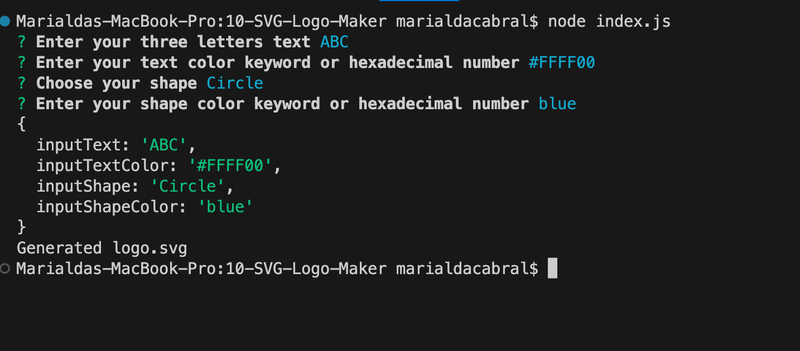
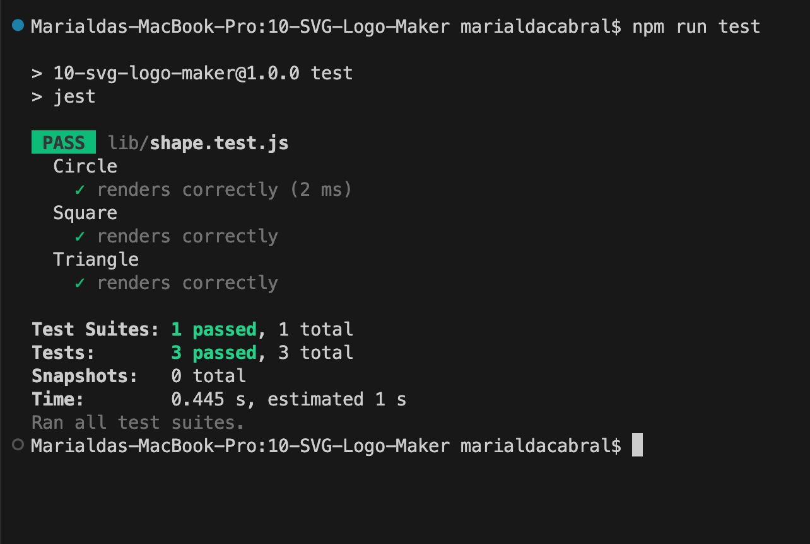
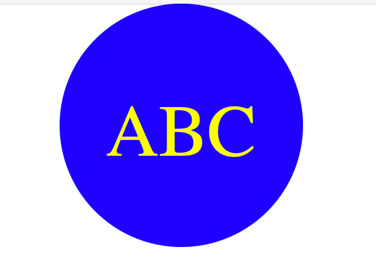

# SVG-Logo-Maker

## Table of Contents
  - [Description](#description)
  - [Installation](#installation)
  - [Test](#test)
  - [Screenshots](#screenshots)
  - [Demonstration](#demonstration)
  - [Contact](#contact)
 
## Description
This application requires: text, shape and colors, provided by the user though the terminal. Then, it generates a logo "logo.svg" file with a SVG image.

## Installation
1 - Clone repository https://github.com/Marialdinha/10-SVG-Logo-Maker  
2 - Install:  
&nbsp;&nbsp;&nbsp;&nbsp;- node.js version 16.6.0  
&nbsp;&nbsp;&nbsp;&nbsp;- inquirer.js version 8.2.4  
&nbsp;&nbsp;&nbsp;&nbsp;- jest version 29.5.0  
3 - Open the cloned repository in any source code editor.  
4 - Run: "node index.js" on the terminal  

## Test
Run "npm run test" in the terminal

## Screenshots  
  
Command Line Application
   
     

NPM Testing (jest testing)
   
     

Generated file (logo.svg)
   

## Demonstration
Video demonstrating how the app works

https://www.loom.com/share/90f00d99a9354b34a96550f679160561?sid=fd85d88b-5252-4988-a08a-793ce72989fa
  
## Contact
You can contact me via email: marialda@bellsouth.net
